# 🧠 Enterprise Insights Copilot

[](https://github.com/MlvPrasadOfficial/enterprise-insights-copilot/actions/workflows/ci.yml)


> **Enterprise-grade conversational BI platform with LLMs, RAG, multi-agent orchestration, and dynamic visualization for data-driven insights.**

---

## 🚀 Features

- 📁 **Modern UI with CSV Upload** featuring elegant glassmorphic design
- 💬 **Natural Language Processing** for intuitive data querying
- 🧠 **Advanced Multi-Agent System** with specialized AI agents
- 📊 **Dynamic Data Visualization** with real-time chart generation
- 🧾 **Natural Language → SQL → Result** pipeline for non-technical users
- 📌 **Auto-insights Generation** for KPIs, anomalies, and trends
- 🧱 **Modular Architecture** with DataAgent, QueryAgent, ChartAgent, SQLAgent, InsightAgent
- 🖥️ **Responsive React/Next.js Frontend** with TypeScript
- 🤖 **Real-time Agent Feedback** with detailed progress tracking
- 🧩 **Comprehensive Error Handling** with actionable user messaging
- 🌐 **FastAPI Backend** with efficient Python processing
- 🔎 **Advanced Observability** with logging and tracing

---

## 🏗️ **System Architecture**

📋 **[View Complete System Architecture](./docs/SYSTEM_ARCHITECTURE.md)** - Comprehensive flowchart covering frontend, backend, agents, data flow, orchestration, and CI/CD pipeline.

**Updated Architecture Overview:**

```mermaid
flowchart TD
    A[👤 Modern UI Layer] --> B[🌐 FastAPI Backend]
    B --> C[🎯 Agent Orchestrator]
    C --> D1[🧠 Planning Agent]
    D1 --> E1[💡 Insight Agent]
    D1 --> E2[🔍 SQL Agent]
    D1 --> E3[📊 Chart Agent]
    D1 --> E4[📝 Narrative Agent]
    D1 --> E5[📋 Report Agent]
    C --> F[🗄️ Data Store]
    C --> G[🤖 LLM API]
    E1 & E2 & E3 & E4 & E5 --> H[💻 React/Next.js UI]
    H --> I[🖌️ Glassmorphic Design System]
```


---

## ⚙️ Tech Stack

| Layer          | Stack                                |
|----------------|---------------------------------------|
| LLM Core       | GPT-4 via OpenAI API                  |
| SQL Engine     | DuckDB                                |
| Frontend       | Next.js + React + TypeScript          |
| Backend        | FastAPI + Python 3.10+                |
| UI Design      | Tailwind CSS + Glassmorphic UI        |
| Charting       | React Visualization Libraries         |
| Multi-Agent    | LangGraph, Agent Orchestration        |
| State Management| React Context + Custom Hooks          |
| Build Tools    | npm/Node.js                           |

---

## 🗂 Folder Structure

```text
enterprise_insights_copilot/
├── backend/           # FastAPI, Agents, Core logic
│   ├── agents/        # QueryAgent, ChartAgent, InsightAgent, etc.
│   ├── agentic/       # Multi-agent orchestration system
│   ├── core/          # LLM integration, utilities
│   ├── api/           # API routes and endpoints
│   └── main.py        # FastAPI entrypoint
├── config/            # .env, settings, constants, prompts
│   ├── prompts/       # LLM prompt templates
│   └── agent_config.yaml # Agent configuration
├── frontend/          # Next.js + React UI
│   ├── app/           # Next.js app directory
│   ├── components/    # React components
│   ├── utils/         # Frontend utilities and API helpers
│   ├── hooks/         # React custom hooks
│   └── public/        # Static assets
├── data/              # Sample/test data
├── docs/              # Documentation and architecture
├── tests/             # Pytest-based tests (unit + e2e)
├── package.json       # Frontend dependencies
├── requirements.txt   # Backend requirements
├── setup.bat / .sh    # Quickstart scripts (Windows/Linux)
├── render.yaml        # Render.com deployment config
├── Dockerfile         # Container configuration
├── .env               # Environment variables
└── README.md
```

---

## ✅ Quickstart

```powershell
# 1. Clone the repo
git clone https://github.com/your-name/enterprise-insights-copilot.git
cd enterprise_insights_copilot

# 2. Setup backend environment
python -m venv venv
.\venv\Scripts\activate

# 3. Install backend requirements
pip install -r requirements.txt

# 4. Set up environment variables
copy .env.example .env  # Or create .env and fill in required keys

# 5. Run backend
cd backend
uvicorn main:app --reload --port 8000

# 6. Setup frontend dependencies (in a new terminal)
cd frontend
npm install

# 7. Run frontend development server
npm run dev

# 8. Access the application
# Open browser at http://localhost:3000
```

### Using VS Code Tasks

The project includes tasks.json configurations for VS Code:

1. Open the project in VS Code
2. Press `Ctrl+Shift+P` and select "Tasks: Run Task"
3. Choose "Start Frontend" to run the Next.js development server

You can also create your own tasks for combined backend/frontend startup.

---

## 🔑 Environment Variables

Create a `.env` file in the project root or `config/` with:

```
OPENAI_API_KEY=sk-...
PINECONE_API_KEY=...
PINECONE_ENV=us-east-1-aws
ALLOWED_ORIGINS=http://localhost,http://localhost:8501
LANGSMITH_TRACING=true
LANGSMITH_ENDPOINT=https://api.smith.langchain.com
LANGSMITH_API_KEY=your-langsmith-key
LANGSMITH_PROJECT=your-project-name
```

---

## 🧪 Running Tests & CI

```powershell
pytest tests/
```
- All major modules and endpoints are covered by unit and end-to-end tests.
- CI runs on every PR via GitHub Actions (`.github/workflows/ci.yml`).

---

## 💬 Example Prompts

```text
Compare sales performance across product categories
What is the revenue trend by quarter for our top products?
Show me the relationship between price and sales volume
Identify outliers in our customer acquisition costs
Which region has the highest profit margin?
Create a visualization of product sales by category
Generate insights about our best performing products
Analyze the correlation between marketing spend and sales
```

---

## 🌐 API Endpoints

- `GET /health` — Health check
- `GET /ready` — Readiness check
- `POST /api/v1/index` — Upload and index CSV
- `POST /api/v1/query` — Ask a question (RAG)
- `POST /api/v1/chart` — Auto-generate chart
- `POST /api/v1/sql` — Natural language to SQL
- `POST /api/v1/insights` — Get auto-insights
- `POST /api/v1/auto-chart` — Auto chart from query
- `POST /api/v1/agentic` — Run agentic chain
- `POST /api/v1/langgraph` — Run multi-agent LangGraph workflow
- `POST /api/v1/crewai` — Run CrewAI workflow
- `POST /api/v1/debate` — Run debate mode
- `POST /api/v1/report` — Generate PDF report

---

## 🤖 Agent System Architecture

### Core Agents
- **Data Agent**: Processes and analyzes uploaded files, providing dataset statistics and structure information
- **Planning Agent**: Analyzes queries and creates execution plans for other agents
- **Query Agent**: Processes natural language queries and extracts key parameters
- **Retrieval Agent**: Searches for relevant context and information from knowledge bases
- **SQL Agent**: Generates and executes SQL queries against the data
- **Insight Agent**: Analyzes data patterns and generates meaningful business insights
- **Chart Agent**: Creates appropriate data visualizations based on data and query
- **Critique Agent**: Evaluates the quality and accuracy of generated insights
- **Debate Agent**: Provides multiple perspectives on data interpretation
- **Narrative Agent**: Creates coherent stories from data insights
- **Report Agent**: Compiles insights into comprehensive reports

### Agent Orchestration
- Agents work in parallel and sequence based on query requirements
- Specialized agents are activated based on query complexity and intent
- Dynamic feedback loop allows agents to improve outputs based on user interaction
- See `backend/agentic/` for the orchestration implementation details

---

## 🔎 LangSmith/LangChain Tracing

- Enable advanced tracing and observability for all agentic and LLM workflows.
- All traces are sent to your LangSmith dashboard if environment variables are set.
- See [LangSmith docs](https://docs.smith.langchain.com/) for more.

---

## 🛠️ Troubleshooting

- **Missing .env or API keys:** Ensure `.env` is present and contains valid OpenAI, Pinecone, and LangSmith keys.
- **CORS errors:** Set `ALLOWED_ORIGINS` in `.env` to include your frontend URL.
- **File upload issues:** Only CSV files are supported for upload; max size 10MB.
- **Backend/Frontend connection:** Ensure `BACKEND_URL` in Streamlit secrets or config matches your backend address.
- **Test failures:** Check that all dependencies are installed and test data files exist in `data/`.
- **Windows path issues:** Use PowerShell and ensure paths use `\` or `/` as appropriate.

---

## � Recent Updates

### June 2025 Updates
- **UI Enhancement**: Improved agent output displays with dynamic content based on queries
- **Agent System Optimization**: Removed Data Cleaner agent to streamline the agent workflow
- **Frontend Modernization**: Enhanced React components with real-time data integration
- **Performance Improvements**: Optimized agent response rendering and data flow
- **Documentation**: Updated documentation to reflect current system architecture

## 📄 License

MIT License

---

> “Just upload a CSV and ask any question. The AI uses RAG to fetch context, generates charts, SQL queries, and auto-insights — all within seconds. No need for BI tools or SQL knowledge.”

---

## 🚀 Deployment

### Render.com

- Use the provided `render.yaml` or set the start command:

```sh
uvicorn backend.main:app --host 0.0.0.0 --port $PORT
```

- Place your `.env` file in the project root and set environment variables in the Render dashboard (Settings > Environment) as needed.
- If deploying frontend, deploy Streamlit separately or use a static site host. Ensure backend and frontend URLs are set correctly in both environments.

---

## 📚 **Documentation & Architecture**

### **📋 System Architecture**
- **[Complete System Architecture](./docs/SYSTEM_ARCHITECTURE.md)** - Comprehensive MAANG-level architecture documentation
- **[Mermaid Flowcharts](./docs/MERMAID_ARCHITECTURE.md)** - Interactive diagrams for all system components
- **[Interactive Architecture View](http://localhost:3000/architecture)** - Live frontend architecture explorer

### **🔗 Key Architecture Components**
| Component | Description | Documentation |
|-----------|-------------|---------------|
| 🤖 **Optimized Agent System** | Streamlined agents with improved specialization | [Agent Workflows](./docs/agentic_workflows.md) |
| 🌐 **FastAPI Backend** | Python 3.10+ + Pydantic with REST API endpoints | [Backend Guide](./backend/README.md) |
| ⚛️ **Next.js Frontend** | React + TypeScript with modern glassmorphic design | [Frontend Guide](./frontend/README.md) |
| 🗄️ **Data Processing** | Efficient data handling with CSV upload capabilities | [Data Flow](./docs/SYSTEM_ARCHITECTURE.md#data-flow-process) |
| 💬 **Natural Language Processing** | Intelligent query understanding and parameter extraction | [NLP System](./docs/nlp_system.md) |
| 📊 **Dynamic Visualization** | Real-time chart generation with interactive features | [Visualization](./docs/visualization.md) |
| 🔄 **CI/CD Pipeline** | GitHub Actions + Docker for automated deployment | [Deployment](./render.yaml) |

### **🚀 Current Architecture Overview**

```mermaid
flowchart TD
    A[👤 Modern React UI] --> B[🌐 FastAPI Backend]
    B --> C[🎯 Agent Orchestrator]
    C --> D1[📁 Data Agent]
    C --> D2[🧠 Planning Agent]
    D2 --> E1[💡 Insight Agent]
    D2 --> E2[🔍 SQL Agent]
    D2 --> E3[📊 Chart Agent]
    D2 --> E4[📝 Narrative Agent]
    D2 --> E5[🔍 Query Agent]
    D2 --> E6[📚 Retrieval Agent]
    C --> F[🗄️ Data Store]
    C --> G[🤖 LLM API]
    E1 & E2 & E3 & E4 & E5 & E6 --> H[⚛️ Next.js Frontend]
    H --> I[👁️ User View]
```


---

## 🎨 UI & User Experience

- **Glassmorphic Design**: Modern, elegant UI with depth and transparency effects
- **Real-time Agent Feedback**: Visual indicators of agent activity and progress
- **Dynamic Content Generation**: Agent outputs adapt based on query context and data structure
- **Responsive Layout**: Optimized for both desktop and tablet viewing experiences
- **Interactive Components**: Expandable panels, tooltips, and contextual information
- **Error Handling**: User-friendly error messages with actionable guidance
- **Data Visualization**: Clean, informative charts with consistent styling

## 💼 Enterprise Ready

- Modular, production-grade codebase with clean architecture
- Comprehensive error handling and logging
- Optimized agent system with specialized AI capabilities
- Responsive UI suitable for professional environments
- CI/CD ready with containerization support
- Extensive documentation and architecture diagrams

---

For advanced usage and architecture, see `README_ADVANCED.md`.
