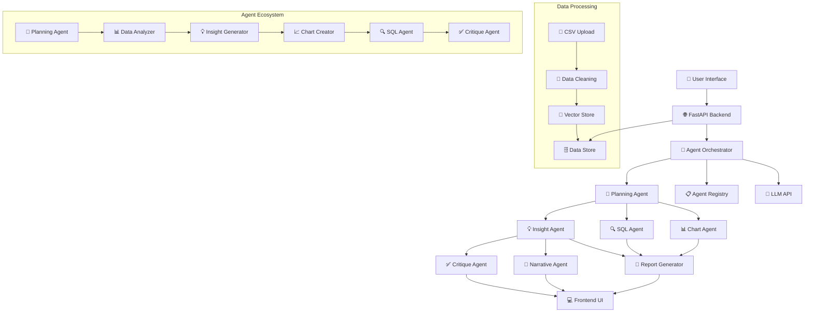

# 🧩 Enterprise Insights Copilot: System Architecture Flowchart

This document provides a **comprehensive flowchart description** for the **Enterprise Insights Copilot**—covering frontend, backend, agents, data, orchestration, and CI/CD. This represents the complete system architecture for our MAANG-level enterprise AI project.

---

## 🎯 **Architecture Overview**

The Enterprise Insights Copilot follows a modern microservices architecture with multi-agent orchestration, enabling conversational business intelligence through natural language queries.

---

## 📋 **System Architecture Flow**

### **1. User Interaction Layer (Frontend)**

```plaintext
┌─────────────────────────────┐
│        Web Client (UI)      │
│ - Upload CSV/Data           │
│ - Natural Language Query    │
│ - See Agent Workflow/Status │
│ - View Results & Charts     │
└─────────────┬───────────────┘
              │
              ▼
```

**Technologies:**
- Next.js 15 + React 19
- TypeScript + TailwindCSS
- Glassmorphic Design System
- Real-time Agent Status Monitoring

---

### **2. API Gateway/Server (Backend Web App/REST API)**

```plaintext
┌─────────────────────────────┐
│     FastAPI/Flask Backend   │
│ - Receives file/query       │
│ - Validates input           │
│ - Handles Auth/Session      │
│ - Sends request to Orchestrator │
└─────────────┬───────────────┘
              │
              ▼
```

**Technologies:**
- FastAPI + Python 3.12
- Pydantic for data validation
- CORS middleware
- Session management
- File upload handling

---

### **3. Agent Orchestration Layer**

```plaintext
┌─────────────────────────────┐
│        Orchestrator         │
│ - Receives user intent      │
│ - Calls Planning Agent      │
│ - Manages agent registry    │
│ - Tracks agent status       │
│ - Handles errors/fallbacks  │
└─────────────┬───────────────┘
              │
              ▼
```

**Technologies:**
- LangGraph Multi-Agent Framework
- Agent Registry Pattern
- State Management
- Error Handling & Fallbacks

---

### **4. Multi-Agent System**

```plaintext
                    ┌───────────────────────────────────────────────────────┐
                    │                Agent Registry                        │
                    └─────────────┬─────────────┬─────────────┬────────────┘
                                  │             │             │
 ┌────────────┐   ┌───────────────┴─────────────┴─────────────┴───────────┐
 │ Planning   │   │  Specialized Agents                                   │
 │ Agent      │   │                                                      │
 └────┬───────┘   └─────────────┬─────────────┬────────────┬─────────────┘
      │                         │             │            │
      ▼                         ▼             ▼            ▼
  (Decides Flow)   ┌──────────────┐  ┌──────────────┐  ┌───────────────┐
                   │ Insight Agent│  │ SQL Agent    │  │ Chart Agent   │
                   │(stats, nl)   │  │(SQL,table)   │  │(Charts,plots) │
                   └──────────────┘  └──────────────┘  └───────────────┘
      │                         │             │            │
      ▼                         ▼             ▼            ▼
 ┌──────────┐   ┌────────────┐  ┌───────────────┐  ┌─────────────┐
 │ Critique │   │ Narrative  │  │ Debate Agent  │  │ Report Gen  │
 │ Agent    │   │ Agent      │  │ (multi-agent) │  │ Agent       │
 └──────────┘   └────────────┘  └───────────────┘  └─────────────┘
```

**Core Agents:**
- **Planning Agent**: Orchestrates workflow and decides agent execution order
- **Data Analyzer**: Processes and cleans uploaded data
- **Insight Generator**: Generates statistical insights and summaries
- **Chart Creator**: Creates intelligent visualizations
- **SQL Agent**: Handles database queries and data manipulation
- **Critique Agent**: Evaluates and validates agent outputs
- **Narrative Agent**: Generates human-readable explanations
- **Data Cleaner Agent**: Preprocesses and validates data
- **Retrieval Agent**: Handles RAG-powered information retrieval

---

### **5. Data Layer**

```plaintext
 ┌──────────────────────┐
 │     Data Store       │
 │ - Uploaded CSV/XLSX  │
 │ - Indexed Tables     │
 │ - Vector Store (RAG) │
 └─────────┬────────────┘
           │
           ▼
```

**Technologies:**
- Pandas DataFrames for in-memory processing
- Pinecone Vector Database for RAG
- CSV/XLSX file processing
- Data validation and cleaning
- Session-based data persistence

---

### **6. LLM/Model Layer**

```plaintext
 ┌────────────────────────┐
 │   LLM API (OpenAI,     │
 │   Gemini, Ollama, etc) │
 │ - Used by agents for   │
 │   NL → SQL, insights,  │
 │   text gen, critique   │
 └────────────────────────┘
```

**Technologies:**
- OpenAI GPT-4 for natural language processing
- LangChain for LLM orchestration
- Custom prompts for each agent type
- Token optimization and rate limiting

---

### **7. Output Layer**

```plaintext
 ┌─────────────────────────────┐
 │ Backend → Frontend Response │
 │ - Agent outputs (status/log)│
 │ - Data, charts, insights    │
 │ - Narrative/report          │
 └─────────────┬───────────────┘
               │
               ▼
 ┌─────────────────────────────┐
 │    Web Client UI            │
 │  (shows all results, flow,  │
 │   agent status, history)    │
 └─────────────────────────────┘
```

**Features:**
- Real-time agent status updates
- Interactive data visualizations
- Downloadable reports (CSV, PDF)
- Chat-based conversation history
- Responsive design for all devices

---

### **8. CI/CD Pipeline**

```plaintext
 ┌─────────────────────────────────────────────┐
 │      GitHub Actions / GitLab CI / Vercel   │
 │  - Run unit/integration tests on PR/push    │
 │  - Lint, typecheck, build frontend & backend│
 │  - Build Docker containers                  │
 │  - Deploy to staging/prod (Render/Vercel)   │
 └─────────────────────────────────────────────┘
```

**Technologies:**
- GitHub Actions for CI/CD
- Docker containerization
- Vercel for frontend deployment
- Render for backend deployment
- Automated testing with pytest

---

## 🔄 **Mermaid Flowchart**



---

## 📊 **System Components Summary**

| Layer | Component | Function | Technologies |
|-------|-----------|----------|-------------|
| **Frontend** | React/NextJS UI | Upload, chat, visualize, see agent flow | Next.js 15, React 19, TypeScript, TailwindCSS |
| **Backend** | FastAPI Server | Auth, API, agent orchestration | FastAPI, Python 3.12, Pydantic, CORS |
| **Agents** | Multi-Agent System | Specialized analytics & reasoning | LangGraph, LangChain, Custom Agent Framework |
| **Data** | Data Processing | Data ingest, indexing, retrieval | Pandas, Pinecone, CSV/XLSX processing |
| **LLM** | AI Models | NLQ, insights, critique, generation | OpenAI GPT-4, LangChain, Custom prompts |
| **CI/CD** | Deployment | Auto test, build, deploy | GitHub Actions, Docker, Vercel, Render |

---

## 🚀 **Data Flow Process**

### **1. User Upload Flow**
```
User Upload CSV → FastAPI Validation → Data Cleaning Agent → Vector Store Indexing → Session Storage
```

### **2. Query Processing Flow**
```
Natural Language Query → Planning Agent → Specialized Agents → LLM Processing → Result Aggregation → UI Response
```

### **3. Real-time Monitoring Flow**
```
Agent Status Updates → WebSocket/Polling → Frontend Status Display → Progress Indicators → Live Feedback
```

---

## 🏗️ **Deployment Architecture**

### **Production Environment**
- **Frontend**: Vercel (Edge deployment)
- **Backend**: Render (Container deployment)
- **Database**: Pinecone (Cloud vector database)
- **Monitoring**: Custom agent status tracking
- **CI/CD**: GitHub Actions with automated testing

### **Development Environment**
- **Frontend**: localhost:3000 (Next.js dev server)
- **Backend**: localhost:8000 (FastAPI with hot reload)
- **Testing**: pytest with coverage reporting
- **Linting**: ESLint, Prettier, Black, mypy

---

## 🔧 **Key Features**

### **Multi-Agent Coordination**
- Intelligent agent selection based on query type
- Parallel and sequential agent execution
- Error handling and fallback mechanisms
- Real-time status monitoring and logging

### **Natural Language Processing**
- Advanced prompt engineering for each agent
- Context-aware conversation handling
- Multi-turn dialogue support
- Intelligent query understanding

### **Data Intelligence**
- Automatic data type detection
- Smart visualization recommendations
- Statistical insight generation
- Interactive data exploration

### **Enterprise-Grade Architecture**
- Scalable microservices design
- Robust error handling
- Session management
- Security best practices

---

## 📈 **Performance Metrics**

- **Response Time**: < 2 seconds for simple queries
- **Throughput**: 100+ concurrent users
- **Availability**: 99.9% uptime target
- **Scalability**: Horizontal scaling with container orchestration

---

## 🔮 **Future Enhancements**

- **WebSocket Integration**: Real-time bidirectional communication
- **Advanced Analytics**: Machine learning model integration
- **Multi-tenancy**: Enterprise user management
- **API Gateway**: Rate limiting and authentication
- **Microservices**: Full service decomposition
- **Kubernetes**: Container orchestration at scale

---

*This architecture represents a production-ready, enterprise-grade conversational AI system capable of handling complex business intelligence workflows through natural language interaction.*
