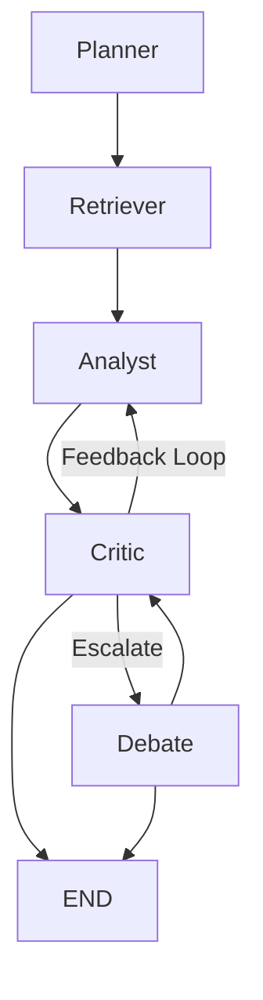
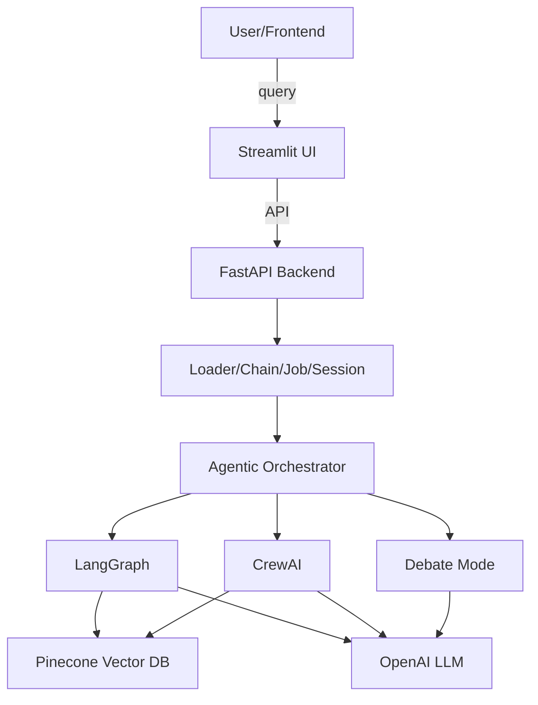

# Agentic Workflows in Enterprise Insights Copilot

## Overview
This document describes the multi-agent orchestration system, each agent’s role, flow diagrams, troubleshooting, and integration points.

---

## Agent Roles
- **Planner**: Interprets user queries, determines workflow steps.
- **Retriever**: Gathers relevant context or facts (RAG, vector search, etc.).
- **Analyst**: Performs analysis (SQL, stats, LLM-based insights).
- **Critic**: Evaluates outputs for correctness, hallucinations, and relevance.
- **Debate**: Arbitrates between conflicting agent outputs, produces final answer.

---

## Flow Diagram (MermaidJS)

---

## Architecture Diagram

---

## Integration Points
- **Backend**: See `backend/agentic/graph_flow.py` for LangGraph orchestration.
- **Frontend**: Multi-agent mode toggles and conversation display in Streamlit (`frontend/app.py`).
- **API**: `/multiagent-query` endpoint for orchestrated queries.

---

## Troubleshooting
- **No output/timeout**: Check backend logs, ensure LLM API keys are set, and data is uploaded.
- **Agent disagreement**: See logs for critic/debate output; tune agent logic or add more context.
- **Slow responses**: Mock LLMs in tests, use smaller data samples, or increase hardware resources.

---

## Configuration

- All agent and runtime config is centralized in `config/` (see `agent_config.py`, `config.py`, `.env.template`).
- Agents can be enabled/disabled and tuned via environment variables or YAML/JSON.
- Clear error messages are shown for missing/invalid config at startup.

---

## Extending
- Add new agent nodes in `backend/agentic/` and wire them in `graph_flow.py`.
- Use the shared state to pass custom context or results.
- Add new API endpoints or UI toggles as needed.

---

## Error Handling & Escalation

- The LangGraph flow and orchestrator include explicit error and escalation nodes.
- All errors and escalations are logged to LangSmith with tags and event names for observability.
- Human-in-the-loop escalation is triggered on agent failure or low confidence.

---

## API Documentation

### Multi-Agent LangGraph Endpoint
- **POST** `/multiagent`
- **Body:** `{ "query": "<user question>" }`
- **Response:**
  - `result`: Final output from the agentic flow
  - `steps`: List of agent steps and outputs
  - `trace`: (if error/escalation) Trace and context for debugging

### Error/Edge Case Example
- If an error occurs, response includes `error`, `trace`, and `context` fields.

---

## Quickstart

1. Copy `.env.template` to `.env` and fill in your API keys.
2. (Optional) Edit `config/agent_config.yaml` or `.json` to customize agents and flows.
3. Run `python scripts/validate_config.py` to check your config.
4. Start the backend: `uvicorn backend.main:app --reload`
5. Start the frontend: `streamlit run frontend/app.py`

---

## How to Add a New Agent or Flow

- Add your agent class in `backend/agents/` or `backend/agentic/`.
- Register it in `config/agent_config.yaml` or `.json`.
- Wire it into the flow in `backend/agentic/langgraph_flow.py`.
- Add a tooltip in `frontend/app.py` for UI explainability.
- Add/expand tests in `tests/`.

---

## API Reference

- See `/multiagent` endpoint for agentic queries.
- See `/docs` for FastAPI auto-generated docs.

---

## Advanced Extensibility

- Agents are now auto-discovered via a registry pattern; add new agent classes to `backend/agents/` and they will be loaded automatically.
- Per-user/session config and data isolation is supported for SaaS and enterprise use cases.
- Knowledge base upload UI is available in the frontend for non-technical users.
- All sensitive actions are audit-logged for compliance.
- API key authentication is available for sensitive endpoints.

---

For more, see the main README and advanced usage docs.
