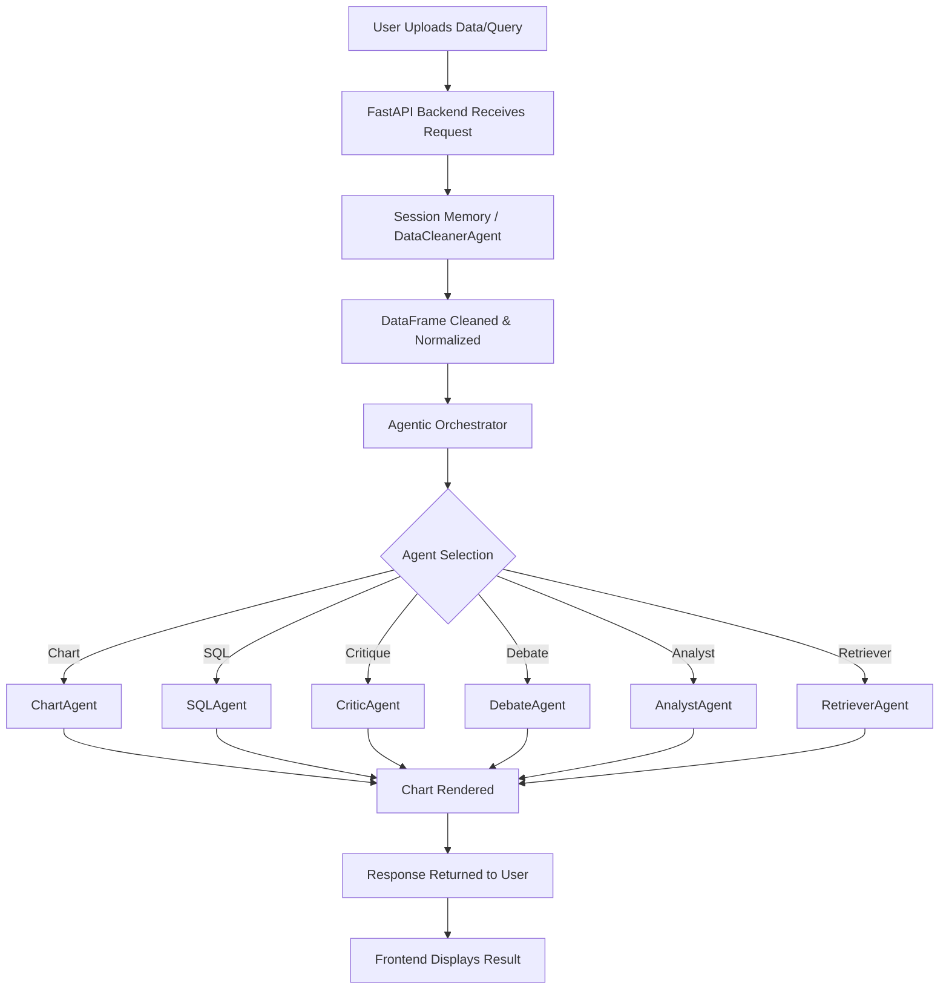

# Project Flowchart

## Directory Structure (Summary)

- `backend/` — FastAPI backend, agents, orchestrator, core logic
- `frontend/` — Frontend app (React or similar)
- `tests/` — All test modules
- `data/` — Sample datasets/uploads

## Main Flow

1. **User uploads data or submits a query via frontend.**
2. **Backend receives request, stores session, and cleans data.**
3. **Agentic orchestrator selects and runs the appropriate agent(s).**
4. **Agent(s) process data and generate results (charts, answers, critiques, etc.).**
5. **Backend returns the result to the frontend for display.**
